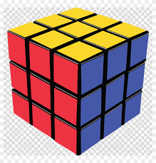

# NeuralCube - 3D Rubik's Cube Solver

A beautiful, interactive 3D Rubik's Cube simulator built with Three.js, featuring an AI-powered solver using search algorithms.



## Features

- 🎲 **Multiple Cube Sizes**: Support for 2×2, 3×3, 4×4, 5×5, and Mirror cubes
- 🧠 **AI Solver**: Automated solving using search algorithms
- 🎨 **Beautiful 3D Visualization**: Smooth animations and modern UI
- ⚡ **Turbo Mode**: Adjustable animation speed
- 🎯 **Real-time State Tracking**: Accurate cube state representation

## Getting Started

### Prerequisites

- A modern web browser with ES module support
- A local web server (for ES modules to work)

### Installation

1. Clone the repository:
```bash
git clone https://github.com/sire-magnusss/3D-Rubix-Project.git
cd 3D-Rubix-Project
```

2. Start a local web server:

**Using Python:**
```bash
python3 -m http.server 8080
```

**Using Node.js:**
```bash
npx http-server -p 8080
```

3. Open your browser and navigate to:
```
http://localhost:8080
```

## Usage

1. **Select Cube Size**: Choose from 2×2, 3×3, 4×4, 5×5, or Mirror cube
2. **Scramble**: Click the "Scramble" button to randomize the cube
3. **Auto-Solve**: Click "Auto-Solve" to let the AI find a solution
4. **Adjust Speed**: Use the speed slider to control animation speed

## Solver Implementation

The project currently implements a **BFS (Breadth-First Search)** and **IDA* (Iterative Deepening A*)** based solver. However, due to the complexity of the state space (especially with orientation tracking), the solver may encounter timeout issues for certain cube configurations.

### Current Status

- ✅ Basic BFS implementation
- ✅ IDA* algorithm for memory efficiency
- ✅ State representation with position and orientation tracking
- ⚠️ **Known Issues**: 
  - Timeout issues on complex scrambles
  - One column at medium speed may not align properly (visual alignment bug)
  - Solver may not find solutions within time limits for difficult states

### Contributing Solvers

**We encourage contributions!** If you'd like to improve the solver or implement alternative algorithms, here are some ideas:

- **Improved Heuristics**: Better distance estimation for IDA*
- **Pattern Databases**: Pre-computed lookup tables for faster solving
- **Bidirectional BFS**: Search from both start and goal states
- **Two-Phase Algorithm**: Like Kociemba's algorithm for 3×3
- **Optimized State Encoding**: More efficient state representation
- **Web Workers**: Offload computation to prevent UI blocking

The solver code is in `script.js` - look for the `bfsSolve()` and `idaStarSearch()` functions.

## Project Structure

```
3D-Rubix-Project/
├── index.html      # Main HTML file
├── script.js       # Three.js scene, cube logic, and solver
├── style.css       # UI styling
├── rubix.png       # Favicon
└── README.md       # This file
```

## Technical Details

### State Representation

The cube state is represented as:
- **Position**: Each piece's (x, y, z) coordinates
- **Orientation**: Face colors on each piece's local axes
- **Encoding**: String-based encoding for state deduplication

### Move System

- Supports all standard cube moves (face rotations)
- Quarter-turn moves (CW and CCW)
- Works for all cube sizes (2×2 through 5×5)

### Animation System

- Smooth rotation animations
- Queue-based move processing
- Configurable animation speed

## Known Issues

1. **Solver Timeouts**: Complex scrambles may cause the solver to hit time/node limits
2. **Visual Alignment Bug**: One column at medium speed may not align properly during animations
3. **State Synchronization**: Occasional desync between visual and logical state (work in progress)

## Future Improvements

- [ ] Fix visual alignment bug
- [ ] Implement pattern databases for faster solving
- [ ] Add move notation display (R, U, F, etc.)
- [ ] Support for custom scrambles
- [ ] Solution step-by-step replay
- [ ] Performance optimizations

## License

This project is open source and available for educational purposes.

## Acknowledgments

- Built with [Three.js](https://threejs.org/)
- Inspired by classic Rubik's Cube solving algorithms

## Contributing

Contributions are welcome! Please feel free to:
- Report bugs
- Suggest improvements
- Submit pull requests
- Implement better solving algorithms

---

**Note**: This project was created as a learning exercise. The solver implementation may not be optimal, and we encourage the community to improve it with better algorithms, heuristics, or optimizations!
